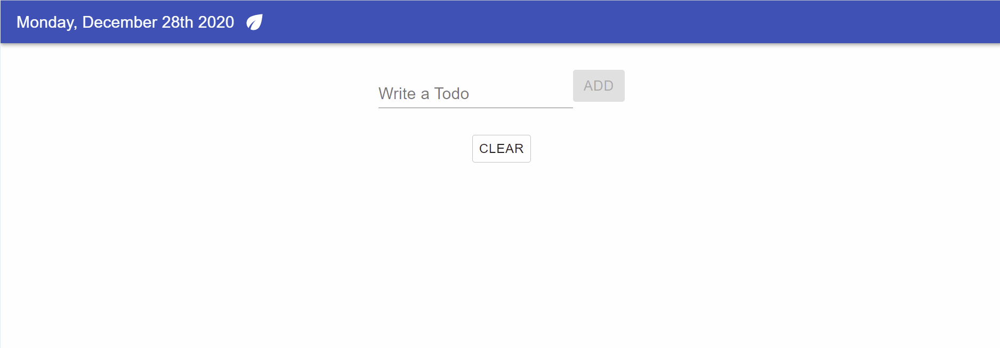
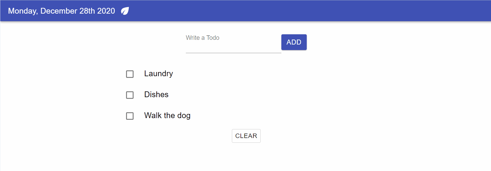

# To Do List

This is a minimalist To Do List app I built using React, Material UI, and Firebase. My goal was to gain experience using a Firebase Firestore database. Users can add tasks, delete selected tasks, and clear all tasks. 

## Demo
#### Adding a task:

#### Deleting and clearing tasks:

